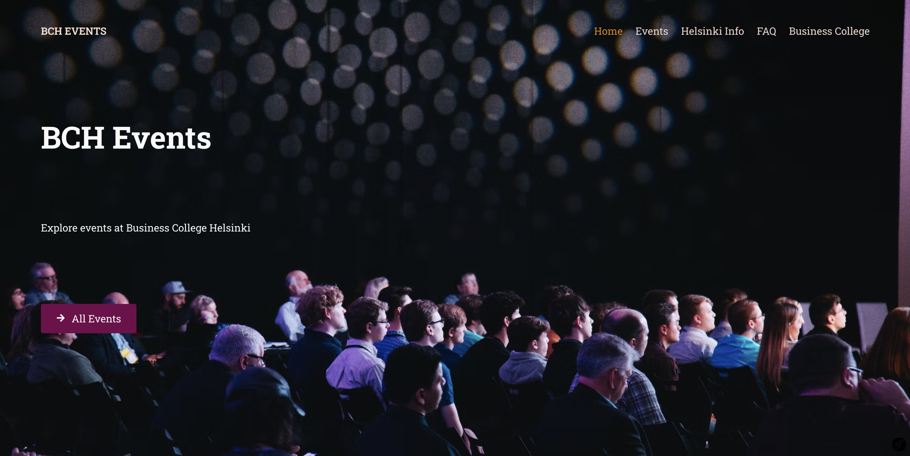

# Summer Project

This is a full stack application designed for our [school!](https://en.bc.fi/)

Our school has a need for an event page/app, and we were assigned to come up with the best solution we could in 3 weeks as a team.

The application allows users to browse the school's events. In the admin dashboard, school admins can easily create, see, update and delete information about upcoming and past events. Admins are also able to send invites to people, and send notifications to event attendees.

The app also features an information page about Helsinki, and an FAQ page.

## Technologies used

- Reactjs
- CSS
- Symfony 6.2
- Docker

## Installation

```shell
git clone https://github.com/jekku123/summer-project
cd summer-project
cd web
composer install
npm install
docker-compose up --build
npm run watch
docker ps
docker exec -it <Fill me> /bin/sh
cd web
bin/console make:migration
bin/console doctrine:migrations:migrate
bin/console doctrine:fixtures:load --no-interaction
```

## Authors

[3n1tan](https://github.com/3n1tan), [jekku123](https://github.com/jekku123), [julilan](https://github.com/julilan), [markusVJH](https://github.com/markusVJH) & [shree0007](https://github.com/shree0007)

## Screenshots




